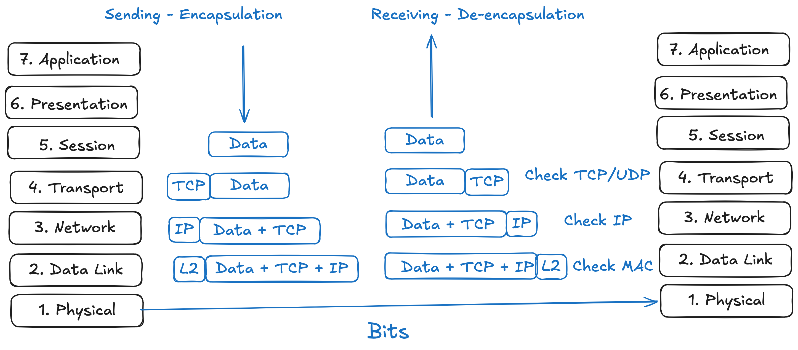
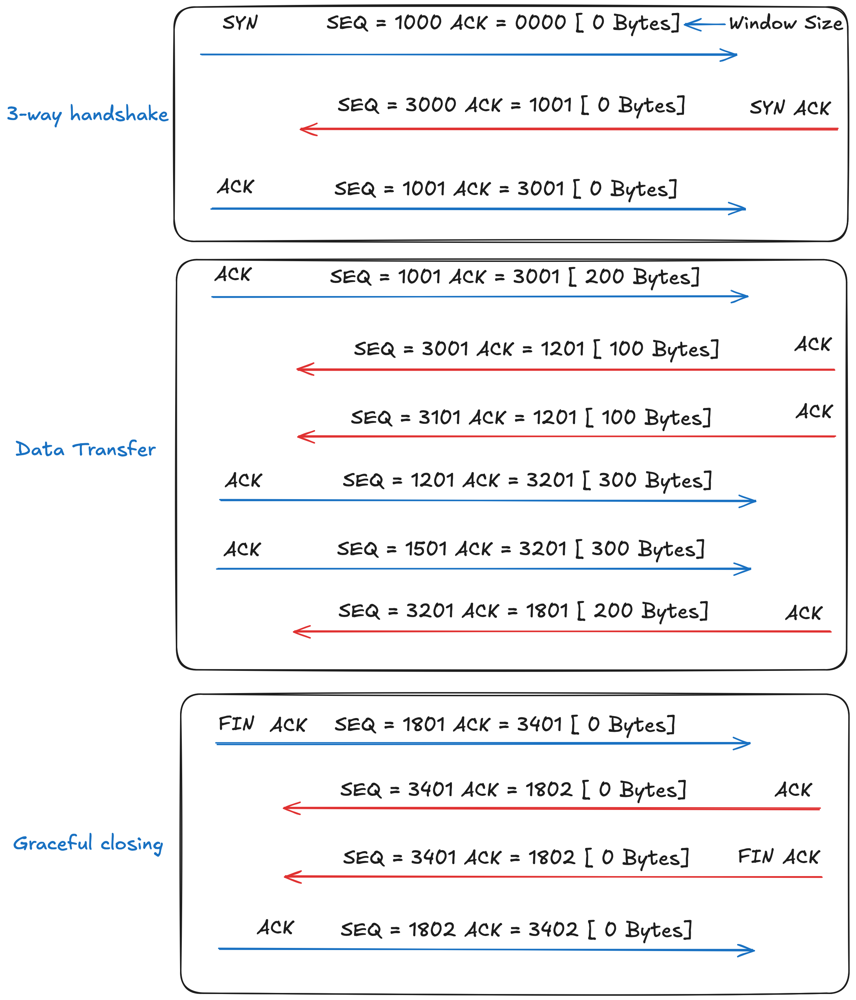

# networking-notes

Technical notes tracking my understanding of network engineering, protocols, and the architecture of the Internet. Simple visualization of the concepts learned.

## 🧠 Core Mental Models
*A selection of my hand-drawn network diagrams.*

> **Note:** Additional diagrams including the `TLS_Handshake`, `Layer1-2-3` interactions, and hardware components (`Routers`, `Switch`) can be found in the `/drawings` directory.

---

## 📚 Topic Index

### 1. Architecture & The Big Picture
* [The OSI Model](./notes/osi_model.md)
* [The Flow: From DNS to Page Render](./notes/the_flow.md)
* [Network Devices (Routers, Switches, etc.)](./notes/network_devices.md)
* [Subnetting Basics](./notes/subnetting.md)

### 2. Transport & Network Layers (TCP/IP)
* [TCP vs. UDP](./notes/tcp_udp.md)
* [Public vs. Private IP Addresses](./notes/public_private.md)
* [Ports & Sockets](./notes/ports.md)
* [TCP & ARP Interactions](./notes/tcp_arp.md)

### 3. Application Layer & Security
* [DNS (Domain Name System)](./notes/dns.md)
* [HTTP / HTTPS](./notes/http.md)
* [TLS & Encryption](./notes/tls.md)
* [General Application Protocols](./notes/protocols.md)

### 4. Packet Analysis
* [Wireshark Observations](./notes/wireshark.md)